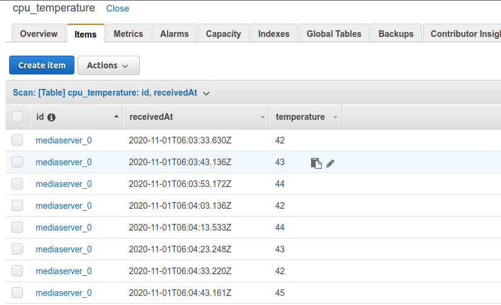

# AWS IoT Demo

This project is a quick demo for using AWS IoT to collect CPU temperature from an edge device, and record it in DynamoDB every 10 seconds. There will be a RESTful API to query the data.

# The Edge Device

It can be any device that compatible with AWS IoT. In this example, I am using my home Plex Media Server (running Ubuntu Server) as the edge device.

## Collecting CPU Temperature Data

Collecting CPU temperature data is done via [Node-RED](https://nodered.org/). A node module [node-red-contrib-cpu](https://flows.nodered.org/node/node-red-contrib-cpu) is used to read CPU temperature from local sensors.

Collected data is published to AWS IoT via [MQTT](https://mqtt.org/)


The flow script can be found in node-red/flow.json, which can be imported into Node-RED. You need to replace with your own AWS certificates and endpoints

Data published into MQTT are in following format:

```json
{
  "topic": "temperature/cpu",
  "payload": {
    "deviceId": "mediaserver_0",
    "temperature": 42
  },
  "_msgid": "523478a5.762668"
}
```

# AWS Lambda
## cpuTemperatureStore

Script file `src/cpuTempertureStore/index.js`. 

This lambda will be triggered when a MQTT message is published by edge device, and the data will be stored into DynamoDB.

## cpuTemperatureQuery

Script file `src/cpuTempertureQuery/index.js`. 

This lambda handles RESTful query API to query data from DynamoDB. Depending on how your Gateway API is configured, the base URL will be different. Assuming the URL is `https://someid.execute-api.your-region.amazonaws.com/prod/demo, below are query examples:

1. Query last 60 second temperatures (default)
```bash
curl https://someid.execute-api.your-region.amazonaws.com/prod/demo
```

2. Query last 120 second temperatures

```bash
curl https://someid.execute-api.your-region.amazonaws.com/prod/demo?du=120
```

3. Query specified period

```bash
curl https://someid.execute-api.your-region.amazonaws.com/prod/demo?du=120&start=2020-11-01T10:30:33Z
```

# DynamoDB

## Table

Table name here is  `cpu_temperature`, partition key `id` with a sort key `receivedAt`.



# API Gateway

An API need to be created under API Gateway and link to cpuTemperatureQuery lambda.

